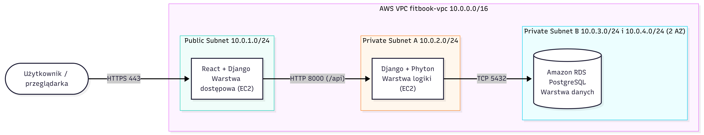

# FitBook

Aplikacja webowa do rezerwacji zajęć fitness. Klienci przeglądają grafik i zapisują się na zajęcia, a administrator tworzy zajęcia i zarządza limitem miejsc. Aplikacja działa w architekturze 3-warstwowej w chmurze AWS.

Projekt zespołowy, Uniwersytet WSB Merito Wrocław.

## Zespół

| Rola | Osoba | GitHub |
|---|---|---|
| PM / DevOps | Krzysztof Okołotowicz | @M1lachite |
| Frontend | Aneta Krzykwa | @Aneta2508 |
| Backend | Konrad Leśny | @Albako |
| DBA | Karolina Wasilewska | @KaWas866 |

## Technologie

- Chmura: AWS
- Front-end: React
- Back-end: Python, Django, 
- Baza danych: PostgreSQL (Amazon RDS)

## Architektura

## Struktura repozytorium

Projekt jest w trakcie przygotowania. Na ten moment nie mamy jeszcze utworzonych docelowych folderów ani pełnej struktury katalogów. W kolejnych etapach repozytorium zostanie rozbudowane o moduły oparte na frameworku Django, który będzie stanowił podstawę całej aplikacji. Pliki i struktura katalogów stworzą się automatycznie przez framework Django po zainicjowaniu projektu.

## Konfiguracja

Adresy i hasła nie są zapisane w kodzie. Konfiguracja odbywa się przez zmienne środowiskowe: skopiuj `.env.example` do `.env` i uzupełnij wartości.

## Frontend (React + Vite)

Uruchomienie lokalne:
cd frontend
copy .env.example .env.local
npm install
npm run dev

Uruchomienie w Dockerze (Nginx):
cd frontend
docker build -t fitbook-frontend .
docker run --rm -p 8080:80 fitbook-frontend

Aplikacja jest dostępna pod adresem http://localhost:8080. Adres API ustawia zmienna `VITE_API_URL`.

## Wdrożenie

_Do uzupełnienia._
